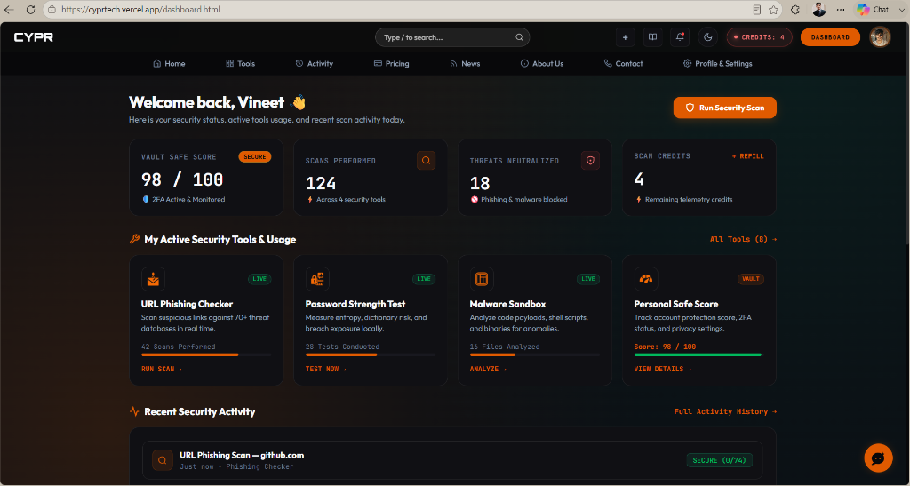
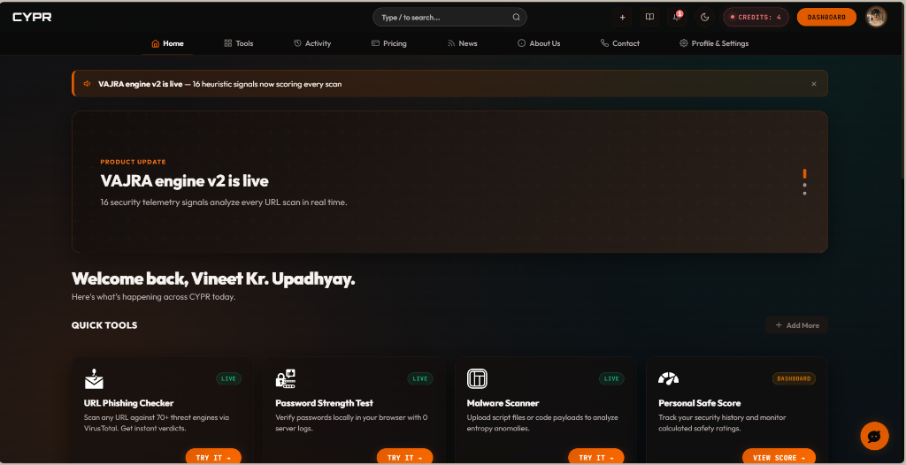
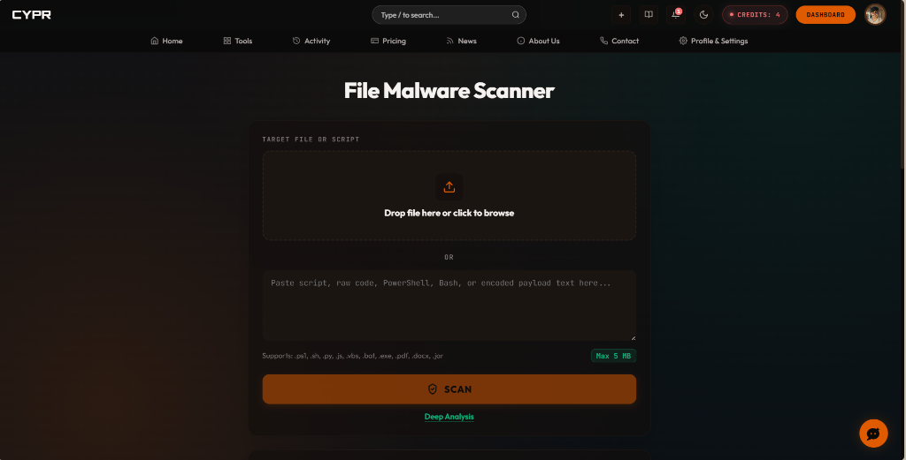
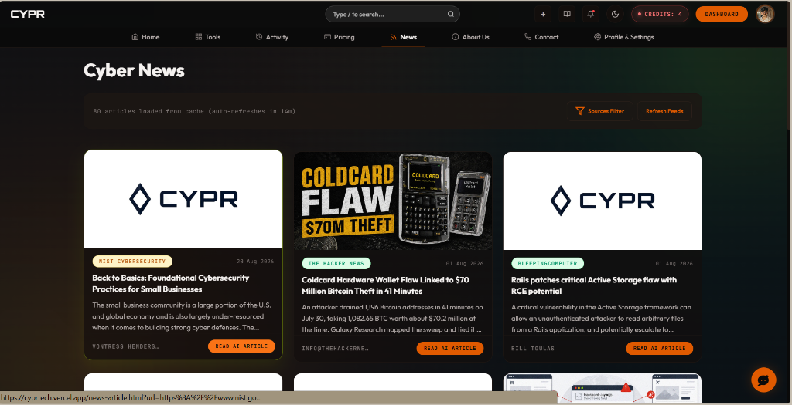
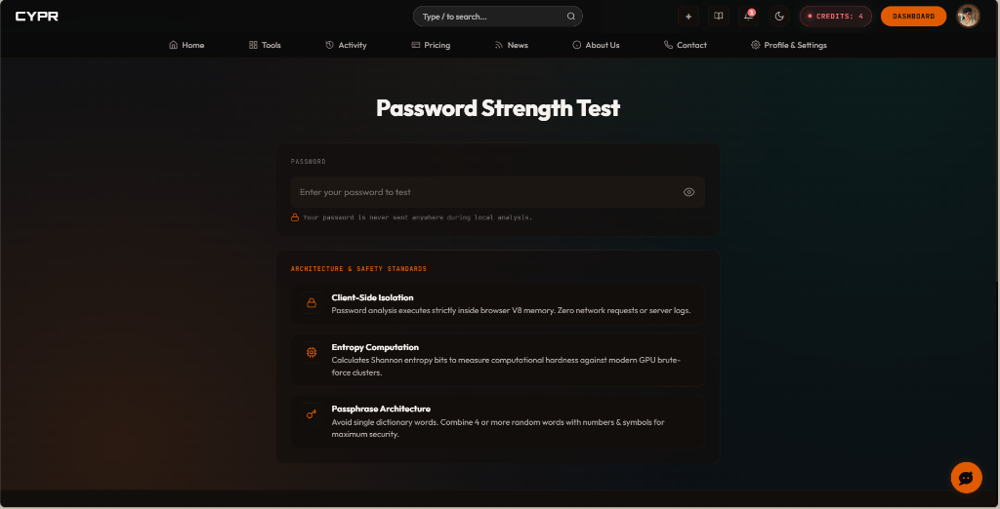

<p align="center">
  <a href="https://github.com/iamvineetupadhyay/CYPR-Tech">
    
  </a>
</p>

<h1 align="center">CYPR Tech</h1>
<p align="center">
  <b>Next-Gen Deterministic Threat Detection & AI Cyber Intelligence Platform</b>
</p>

<p align="center">
  <a href="https://github.com/iamvineetupadhyay/CYPR-Tech"></a>
  <a href="https://github.com/iamvineetupadhyay/CYPR-Tech"></a>
  <a href="https://github.com/iamvineetupadhyay/CYPR-Tech"></a>
  <a href="https://github.com/iamvineetupadhyay/CYPR-Tech"></a>
  <a href="https://github.com/iamvineetupadhyay/CYPR-Tech/actions/workflows/main.yml"></a>
  <a href="LICENSE"></a>
</p>

<p align="center">
  <a href="#key-features">Key Features</a> •
  <a href="#system-architecture">Architecture</a> •
  <a href="#vajra-engine">VAJRA Engine</a> •
  <a href="#screenshots">Screenshots</a> •
  <a href="#installation">Installation</a> •
  <a href="#api-reference">API Docs</a> •
  <a href="#author">Author</a>
</p>

---

## 🛡️ Executive Summary

**CYPR Tech** is a enterprise-grade cybersecurity threat analysis platform designed to identify zero-hour phishing attacks, malicious files, domain typosquatting, and cyber threat vectors before they hit traditional blacklists.

Combining **VAJRA** (a proprietary 16-signal deterministic heuristic detection engine) with multi-engine threat verification (VirusTotal), an interactive **RAG AI Security Buddy**, and an **AI News Web Scraper & Summarizer**, CYPR Tech equips users and security analysts with instant, explainable, and actionable threat intelligence.

---

## ✨ Key Features

| Feature | Category | Description |
| :--- | :--- | :--- |
| **🔍 URL Threat Scanner** | Detection | Real-time URL risk analysis powered by the 16-signal VAJRA Heuristic Engine. |
| **🦠 File Malware Scanner** | Detection | Multi-engine file hash & payload analysis integrated with VirusTotal (70+ AV engines). |
| **🧠 VAJRA Engine** | Core Engine | 100% explainable, zero-ML-drift heuristic engine with explicit mathematical risk scoring. |
| **🤖 RAG AI Buddy** | AI Assistant | Interactive cybersecurity chatbot indexing threat feeds, CVEs, and CYPR tools. |
| **📰 AI Complete News Scraper** | Intelligence | Web scraper & LLM summarizer extracting executive briefs, threat matrices, and mitigations. |
| **🔐 Password Auditor** | Client Security | Zero-knowledge client-side password entropy, breach check, and pattern analysis. |
| **📊 Executive Dashboard** | Analytics | Real-time threat trends, scan metrics, risk distributions, and account security score. |
| **📜 Activity & Audit Logs** | Compliance | Historical timeline of all past scans, security events, IP tracking, and verdicts. |
| **👥 RBAC & Session Auth** | Security | JWT-based statutory sessions with Google/GitHub OAuth and Role-Based Access Control. |
| **🛡️ Anti-Abuse & Bot Defense** | Infrastructure | Rate-limiting, IP reputation checks, and Cloudflare Turnstile integration. |

---

## 📸 Interactive Screenshots & UI Showcase

Click on any tab below to expand high-resolution UI previews:

<details open>
<summary><b>📊 Executive Security Dashboard</b></summary>
<br />
<p align="center">
  
</p>
</details>

<details>
<summary><b>🏠 Welcome Home Security Hub</b></summary>
<br />
<p align="center">
  
</p>
</details>

<details>
<summary><b>🦠 File Malware Scanner & Payload Sandbox</b></summary>
<br />
<p align="center">
  
</p>
</details>

<details>
<summary><b>📰 AI Cyber News Feed & Web Scraper</b></summary>
<br />
<p align="center">
  
</p>
</details>

<details>
<summary><b>🔐 Client-Side Password Entropy & Strength Test</b></summary>
<br />
<p align="center">
  
</p>
</details>

---

## 🏗️ System Architecture

```
[ Browser / Frontend Client (HTML5 / Vanilla JS / Glassmorphism) ]
                              │
                              ▼  (REST API / JWT Bearer)
[ Spring Boot 3.3 Backend Framework (Java 17) ]
  ├── JWT Auth Interceptor & Security Filter
  ├── Rate Limiter & Anti-Abuse Protection
  ├── ⚡ VAJRA 16-Signal Heuristic Engine (In-Process Execution)
  ├── 🤖 RAG Vector Retrieval & AI Synthesis Engine
  └── 🕸️ Multi-Proxy Web Scraper Service
                              │
     ┌────────────────────────┼────────────────────────┐
     ▼                        ▼                        ▼
[ PostgreSQL 15 ]    [ VirusTotal API ]      [ AI Model Provider ]
(Users, Scans, Logs) (Secondary Verification) (Gemini / Groq / Ollama)
```

---

## ⚡ VAJRA Detection Engine (16 Heuristic Signals)

Unlike black-box machine learning classifiers that hallucinate or struggle with explainability, **VAJRA** uses fixed, hand-tuned mathematical heuristics. Given the exact same input, VAJRA produces the exact same score, complete with a line-item breakdown of fired rules.

<details>
<summary><b>Click to expand all 16 Heuristic Signals</b></summary>

| # | Signal | Analytical Scope |
| :---: | :--- | :--- |
| **1** | **Shannon Entropy Analysis** | Measures string randomness in domain/subdomains to detect DGA (Domain Generation Algorithms). |
| **2** | **N-Gram Frequency Modeling** | Evaluates character sequence probabilities against natural domain distributions. |
| **3** | **Levenshtein Distance** | Identifies brand typosquatting (e.g. `paypa1.com`, `goog1e.com`). |
| **4** | **Homoglyph Attack Detection** | Scans for internationalized Cyrillic/Greek Unicode lookalikes spoofing ASCII characters. |
| **5** | **Combosquatting Detection** | Detects high-risk word combinations (e.g. `paypal-login-verify.com`). |
| **6** | **Port Anomaly Inspection** | Flags non-standard web ports (e.g. `:8443`, `:8080`, `:21`) used in phishing URLs. |
| **7** | **URL Structural Length** | Evaluates abnormal URL length designed to bypass display truncation. |
| **8** | **Subdomain Depth Analysis** | Measures excessive subdomain nesting used to disguise malicious destinations. |
| **9** | **TLD Risk Classification** | Scores top-level domain abuse metrics based on threat intelligence telemetry. |
| **10** | **Raw IP Address Hostname** | Flags direct IP addressing (`http://192.168.1.1/login`) omitting domain names. |
| **11** | **URL Shortener Masking** | Detects redirect masking via Bitly, TinyURL, and unverified redirectors. |
| **12** | **Special Character Density** | Measures anomalous ratios of hyphens, digits, and special delimiters. |
| **13** | **Brand Keyword Impersonation** | Scans for financial, tech, and healthcare brand names outside official domains. |
| **14** | **SSL/TLS Validation** | Inspects certificate presence, validity, self-signed signatures, and issuer authority. |
| **15** | **Domain Registration Age** | WHOIS telemetry evaluation for newly-registered domain risk factors. |
| **16** | **Redirect Chain Inspection** | Traces multi-hop HTTP redirect chains to identify payload drop destinations. |

</details>

---

## 🧰 Technology Stack

### **Backend Framework**
- **Core**: Java 17 (LTS), Spring Boot 3.3.x
- **Security**: Spring Security, JWT (JSON Web Tokens), BCrypt Password Hashing
- **Persistence**: PostgreSQL 15, Hibernate ORM, Spring Data JPA
- **Build System**: Apache Maven 3.9+

### **Frontend & UI System**
- **Core**: HTML5, Vanilla CSS3 (Custom Design Tokens, Responsive Grid), ES6+ JavaScript
- **Aesthetics**: Glassmorphism UI, Dark/Light Mode, Orbitron/Inter Typography
- **Charts & Visualization**: Canvas / Micro-animations

### **Integrations & Infrastructure**
- **Threat Intelligence**: VirusTotal v3 REST API, CISA XML, NIST feeds
- **Containers & Cloud**: Docker, AWS EC2, AWS RDS, GitHub Actions CI/CD
- **AI / LLM**: Google Gemini Flash API / Groq API / Local Ollama (Docker support)

---

## 💻 Quick Start & Installation

### Prerequisites
- **Java JDK 17+** installed
- **Maven 3.9+** installed
- **PostgreSQL 15+** running locally or via Docker

### 1. Clone Repository
```bash
git clone https://github.com/iamvineetupadhyay/CYPR-Tech.git
cd CYPR-Tech
```

### 2. Configure Environment
Copy the example environment configuration:
```bash
cp backend/.env.example backend/.env
```
Fill in your database credentials and optional API keys (VirusTotal, JWT Secret).

### 3. Run Backend (Spring Boot)
```bash
cd backend
mvn clean install
mvn spring-boot:run
```
*The Spring Boot REST API will start at `http://localhost:8080`.*

### 4. Open Frontend
Open `frontend/index.html` or `frontend/home.html` in any web browser, or serve it via live server.

---

## 🐳 Docker Deployment

To run CYPR Tech backend inside a Docker container:

```bash
cd backend
docker build -t cypr-backend .
docker run -d -p 8080:8080 --name cypr-backend-container cypr-backend
```

---

## 📡 REST API Quick Reference

| Method | Endpoint | Description | Auth Required |
| :---: | :--- | :--- | :---: |
| `POST` | `/api/user/register` | Create a new user account | ❌ No |
| `POST` | `/api/user/login` | Authenticate user & receive JWT token | ❌ No |
| `GET` | `/api/user/me/profile` | Retrieve profile data, score & credits | 🔒 Yes |
| `POST` | `/api/phish-check` | Submit URL for 16-signal VAJRA analysis | 🔒 Yes |
| `POST` | `/api/malware/scan` | Upload file for multi-engine malware check | 🔒 Yes |
| `GET` | `/api/malware/history/{userId}` | Fetch user's scan history and logs | 🔒 Yes |
| `POST` | `/api/ai/scrape-news` | Scrape & summarize full news article | 🔒 Yes |
| `POST` | `/api/ai/chat-rag` | Query RAG AI Security Buddy | 🔒 Yes |

---

## 🔒 Security & Privacy

- **Zero Plaintext Credentials**: All user passwords are salted & hashed using BCrypt.
- **Stateless Authorization**: Protected routes enforce strict Bearer JWT validation.
- **IDOR / BOLA Prevention**: Object-level access control prevents unauthorized history viewing.
- **Strict Anti-Abuse**: Request rate-limiting and Cloudflare Turnstile bot protection on authentication forms.

---

## 👤 Author & Maintainer

**Vineet**
- **GitHub**: [@iamvineetupadhyay](https://github.com/iamvineetupadhyay)
- **LinkedIn**: [Vineet Upadhyay](https://linkedin.com/in/iamvineetupadhyay)
- **Project Repository**: [CYPR-Tech on GitHub](https://github.com/iamvineetupadhyay/CYPR-Tech)

---

<p align="center">
  <sub>Built with ❤️ for a safer web. If you find CYPR Tech useful, give it a ⭐ on GitHub!</sub>
</p>
